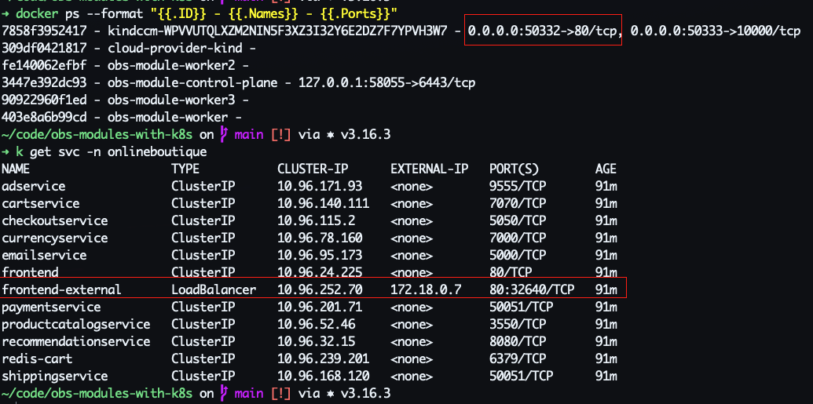

# Demo observibility modules for Kubernetes - WIP

## Pre-requisites

- [kind](https://kind.sigs.k8s.io)
- [helm](https://helm.sh)
- [helmfile](https://helmfile.readthedocs.io/en/latest/)

## Architecture


## Usage

Notice: Because of resource limitation, this repo just set up observibility for onlineboutique namespace completely.


### 1. Run local load balancer with cloud-provider-kind

We are running k8s cluster locally so you should install local load balancer
Kind has a built-in cloud provider controller at the local and it also supports a load balacer with [cloud-provider-kind](https://github.com/kubernetes-sigs/cloud-provider-kind)

```sh
docker run \
    -dit \
    --name cloud-provider-kind \
    --network kind \
    -v /var/run/docker.sock:/var/run/docker.sock \
    registry.k8s.io/cloud-provider-kind/cloud-controller-manager:v0.5.0
```

For MacOS or Windows, kind runs as non-root user (run on VM) so you must map ports to host manually, let's enable `-enable-lb-port-mapping` when starting cloud-provider-kind. [Read more about it here](https://github.com/kubernetes-sigs/cloud-provider-kind?tab=readme-ov-file#enabling-load-balancer-port-mapping)

```sh
docker run \
    -dit --name cloud-provider-kind \
    --network kind \
    -v /var/run/docker.sock:/var/run/docker.sock \
    registry.k8s.io/cloud-provider-kind/cloud-controller-manager:v0.5.0 \
    -enable-lb-port-mapping
```

In below picture, you can see that port mapping is enabled and you can access frontend service via port 50322 from host



### 2. Create a Kubernetes cluster via kind

```sh
kind create cluster --name obs-modules --config ./kind-cluster.yaml
kind export kubeconfig
kubectl get nodes
```

You should see that
```
NAME                       STATUS   ROLES           AGE   VERSION
obs-module-control-plane   Ready    control-plane   77s   v1.31.0
obs-module-worker          Ready    <none>          66s   v1.31.0
obs-module-worker2         Ready    <none>          66s   v1.31.0
```

### 3. Install then onlineboutique system

Install application namespace, this repo is using [demo-microservice](https://github.com/GoogleCloudPlatform/microservices-demo) repo of Google

```sh
helmfile apply -f ./app-onlineboutique/helmfile.yaml
```

### 4. Install observibility modules

Prepare secret values before initializing observibility modules

```yaml
# values.yaml at root of this repo

minio_root_user: admin
minio_root_password: 2E9SuIXsIv

cassandra_user: cassandra
cassandra_password: WrHPSjnqog

grafana_admin_user: admin
grafana_admin_password: admin

loki_s3_client_id: <update>
loki_s3_client_secret: <update>

cortex_s3_client_id: <update>
cortex_s3_client_secret: <update>
```

First, you need to install persistent storage like cassandra and minio
```sh
helmfile apply -l name=cassandra -l name=minio
```

You must create buckets `cortex`, `loki-chunks`, `loki-ruler`, `loki-admin` and create s3 credentials `cortex-s3` and `loki-s3`. After that, let's fill into `values.yaml`

After that, install cortex

```sh 
helmfile apply -l name=cortex
```

Concurently, install log, metrics, tracing, service-mesh and dashboard

```sh 
helmfile apply -l layer=tracing -l layer=log -l layer=metric -l layer=service-mesh -l layer=dashboard
```

### Notice!!!

Have some configuration what I haven't set up yet. You can learn more about Kubernetes if you can find and set up them.

## Results

[Demo video](https://www.youtube.com/watch?v=9BQGGYWfSYQ&list=PL5Uk4IAzZ1pTELVIExV-8x7m2WWtXQOwF&index=5)


