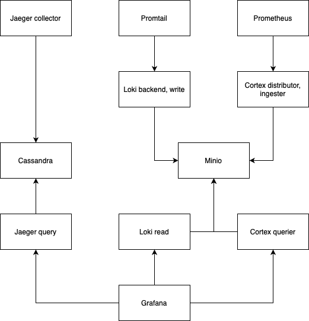

# Demo observibility modules for Kubernetes

## Pre-requisites

- [kind](https://kind.sigs.k8s.io)
- [helm](https://helm.sh)
- [helmfile](https://helmfile.readthedocs.io/en/latest/)

## Architecture



## Usage

Create a kind cluster, view more [kind config](./kind-cluster.yaml)

```sh
$ kind create cluster --name obs-modules --config ./kind-cluster.yaml
$ kind export kubeconfig
$ kubectl get nodes
```

You should see that
```
NAME                       STATUS   ROLES           AGE   VERSION
obs-module-control-plane   Ready    control-plane   77s   v1.31.0
obs-module-worker          Ready    <none>          66s   v1.31.0
obs-module-worker2         Ready    <none>          66s   v1.31.0
```


Install application namespace, this repo is using [demo-microservice](https://github.com/GoogleCloudPlatform/microservices-demo) repo of Google

```sh
$ helm upgrade onlineboutique oci://us-docker.pkg.dev/online-boutique-ci/charts/onlineboutique --install --namespace onlineboutique --create-namespace
$ bash ./onlineboutique-patch.sh
```

Prepare secret values befor initializing observibility modules

```sh
MINIO_ROOT_USER=
MINIO_ROOT_PASSWORD=

CASSANDRA_USER=
CASSANDRA_PASSWORD=

LOKI_S3_CLIENT_ID=
LOKI_S3_CLIENT_SECRET=

CORTEX_S3_CLIENT_ID=
CORTEX_S3_CLIENT_SECRET=

GRAFANA_ADMIN_USER=
GRAFANA_ADMIN_PASSWORD=
```

Run observibility modules

```sh
$ helmfile apply
```

You can add some datasources in grafana

- prometheus: http://prometheus-server.obs-modules.svc.cluster.local
- jaeger: http://jaegertracing-query.obs-modules.svc.cluster.local
- loki: http://loki-read-headless.obs-modules.svc.cluster.local:3100
- cortex: http://cortex-nginx.obs-cortex.svc.cluster.local/api/prom

### Notice!!!

Have some configuration what I haven't set up yet. You can learn more about Kubernetes if you can find and set up them.

## Results

[Demo video](https://www.youtube.com/watch?v=9BQGGYWfSYQ&list=PL5Uk4IAzZ1pTELVIExV-8x7m2WWtXQOwF&index=5)


